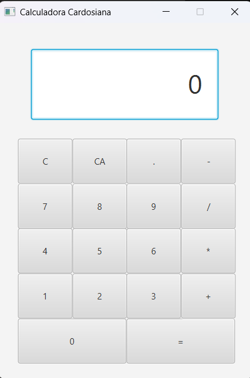
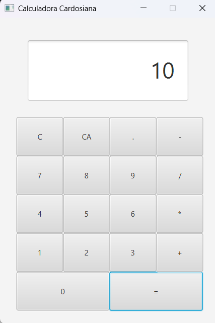

# Project Calculator

## 1. Project Vision

Calculators are not only one of the most useful tools available, but they are also a great way to understand UI and event processing in an application. In this problem you will create a calculator that supports basic arithmetic calculations on numbers.

The aim of this project is to review and apply concepts covered in the software engineering and application courses, in order to simulate a real-world development environment and bridge the gap between academic theory and professional practice. To this end, a simple calculator will be developed.

## Screenshots

### JavaFX Interface

  

### Calculation Example

Result for `5 + 5` -

  

## 2. MVP (Minimum Viable Product)

The basic version can:

- enter numbers;
- perform +, -, *, /;
- display the result;
- clear the input;
- clear the state;
- display an error.

## 3. Out of Scope

Operations involving trigonometric functions, probabilities and complex numbers are outside the scope.

## 4. Features

- Basic arithmetic operations: addition, subtraction, multiplication and division
- Decimal number input
- Sequential operation execution
- 8-digit input limit
- Error handling with `ERR`
- Clear current input with `C`
- Reset calculator state with `AC`
- Console interface
- JavaFX graphical interface

## 5. User Stories

### US01 - Current Number

As a User, I want to see a display showing the current number entered or the result of the last operation, so that I can see what I am doing.

### US02 - Entry Pad

As a User, I want to see an entry pad containing buttons, so that I can choose the numbers and the operations.

Acceptance Criteria:

- AC1 : The digits are in the range 0-9
- AC2 : The operators can be: '+', '-', '/', '=' and '*'
- AC3 : There's also a 'C' button to clear the current number/operator and AC button for clear all.

### US03 - Clicking in the Entry Pad

As a user, I want to enter numerical sequences of up to 8 digits, so that I can perform calculations across different whole number place values.

Acceptance Criteria:

- AC1 : Entry of any digits more than 8 will be ignored.

### US04 -  Operation Result

As a user, I want to click on an operation button to display the result of that operation on the result of the preceding operation and the last number entered, the last two numbers entered or the last number entered, so that I can track the past operations.

Clarification:
This calculator follows sequential execution and does not evaluate full expressions.

### US05 - 'C' Button

As a user, I want to click the 'C' button to clear the last number or the last operation, so that I can correct any mistake.

Acceptance Criteria:

- AC1 : If user's last entry was an operation the display will be updated to the value that preceded it.

### US06 - 'AC' Button

As a user, I want to click the 'AC' button to clear all internal work areas and to set the display to 0, so that I can restart any long operation.

### US07 - 'ERR'

As a user, I want to see 'ERR' displayed if any operation would exceed the 8 digit maximum.

## 6. Business Rules

### Input Rules

- The calculator accepts digits from `0` to `9`.
- The calculator accepts decimal numbers.
- A number may contain only one decimal separator.
- A user-entered number may contain at most 8 numeric digits.
- The decimal separator does not count as a numeric digit.
- Extra digits beyond the limit are ignored.

### Operation Rules

- The calculator supports `+`, `-`, `*` and `/`.
- Operations are evaluated sequentially.
- Full expression parsing is not supported.
- Division by zero is invalid and results in `ERR`.

### Display Rules

- The calculator starts with display value `0`.
- The display shows the current input while the user enters a number.
- The display shows the selected operator after an operator is pressed.
- The display shows the result after a calculation is completed.
- The display shows `ERR` when the calculator enters an error state.

### Result Rules

- A calculated result is valid if its integer part has at most 8 digits.
- If the integer part has more than 8 digits, the calculator enters `ERR`.
- If the integer part fits but the decimal part is too long, the result is rounded to fit the calculator display rule.

### Error Rules

- When the calculator is in `ERR` state, normal numeric and operator input is ignored.
- The calculator can leave `ERR` state using `C` or `AC`.

---

## 7. Architecture

The project follows a simple layered architecture:

Presentation
↓
Application
↓
Domain

### Presentation Layer

The presentation layer implements US02 - Entry Pad using JavaFX.

The UI will display the calculator display and a button grid containing digits, operators, equals, clear and clear all actions. Button clicks will be forwarded to the application layer through the `CalculatorController`.

No calculation logic will be implemented inside the UI.

### Application Layer

Responsible for coordinating user actions.

Main responsibilities:

- receiving input from the presentation layer;
- calling the application service;
- returning the updated display value.

Current application classes:

- `CalculatorController`
- `CalculatorService`

### Domain Layer

Responsible for the calculator rules and state.

Main responsibilities:

- managing the current input;
- managing the stored value;
- managing the pending operator;
- calculating results;
- validating invalid operations;
- updating the display value;
- managing the calculator status.

Current domain classes:

- `Calculator`
- `CalculatorInput`
- `DisplayValue`
- `Calculation`
- `OperatorType`
- `CalculatorStatus`

---

## 8. Domain Model Summary

The calculator core is centered around the `Calculator` aggregate.

The `Calculator` is responsible for maintaining the current state of the calculation and protecting the business rules of the system.

Main domain concepts:

| Concept | Responsibility |
| :--- | :--- |
| `Calculator` | Aggregate root that coordinates the calculator state and operations. |
| `CalculatorInput` | Represents the number currently being entered by the user. |
| `DisplayValue` | Represents the value currently shown on the display. |
| `Calculation` | Represents a completed arithmetic operation. |
| `OperatorType` | Represents the supported arithmetic operators. |
| `CalculatorStatus` | Represents whether the calculator is ready or in error state. |

The full domain model is available in the documentation folder.

---

## 9. Documentation

Additional documentation is available in the `docs/` folder:

- [Glossary](docs/global-artifacts/01.requirements-engineering/glossary.md)
- [Use Case Diagram](docs/global-artifacts/01.requirements-engineering/use-case-diagram.md)
- [Domain Model](docs/global-artifacts/02.analysis/puml/dm/completeDM.md)
- [Design Class Diagram](docs/global-artifacts/02.analysis/puml/global-class-diagram/CD_general.md)

---

## 10. Technologies

- Java
- Maven
- JUnit 5
- JavaFX
- PlantUML for diagrams

---

## 11. Running the Application

To run the JavaFX application:

`mvn javafx:run`

To run the console interface, run the following class from the IDE:

`calculator.presentation.ConsoleApp`

The JavaFX application is the main user interface of the project.

---

## 12. Running Tests

To run the automated tests:

`mvn test`

To compile the project:

`mvn compile`

---

## 13. Learning Goals

This project is used to practice:

- requirements analysis;
- user stories and acceptance criteria;
- domain modelling;
- object-oriented design;
- layered architecture;
- TDD basics;
- unit testing with JUnit;
- incremental development;
- Git commit discipline;
- separation between presentation, application and domain logic.

---

## 14. Notes

This project intentionally uses a simple architecture. The goal is not to overengineer a calculator, but to practice building a small application with clear responsibilities, testable domain logic and maintainable structure.

The design may evolve as implementation progresses.