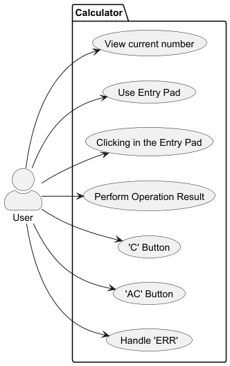

# Use Case Diagram (UCD)

# Use Cases / User Stories

| UC/US | Description                                        |                   
|:------|:---------------------------------------------------|
| US001 | [Current Number](../../us001/ReadMe.md)            |
| US002 | [Entry Pad](../../us002/Readme.md)                 |
| US003 | [Clicking in the entry pad](../../us003/Readme.md) |
| US004 | [Operation Result](../../us004/ReadMe.md)          |
| US005 | ['C' Button](../../us005/Readme.md)                |
| US006 | ['AC' Button](../../us006/Readme.md)               |
| US007 | ['ERR'](../../us007/Readme.md)                     |

